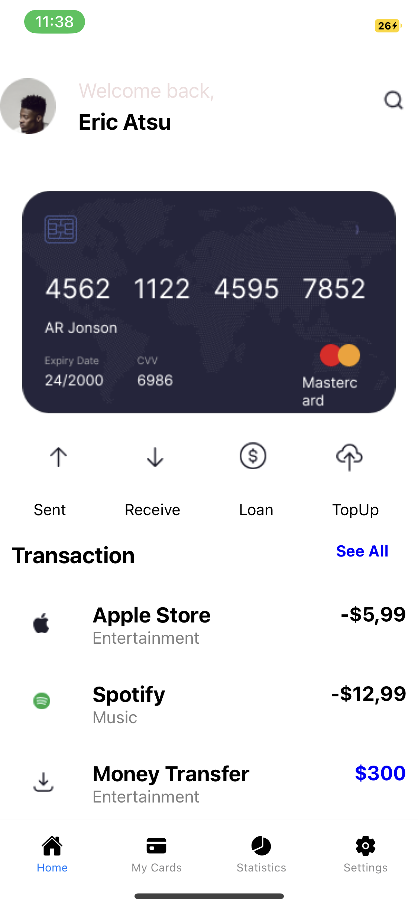
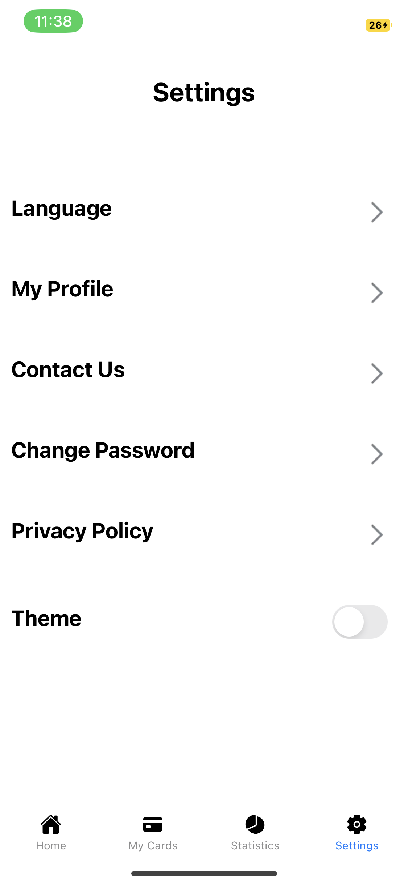
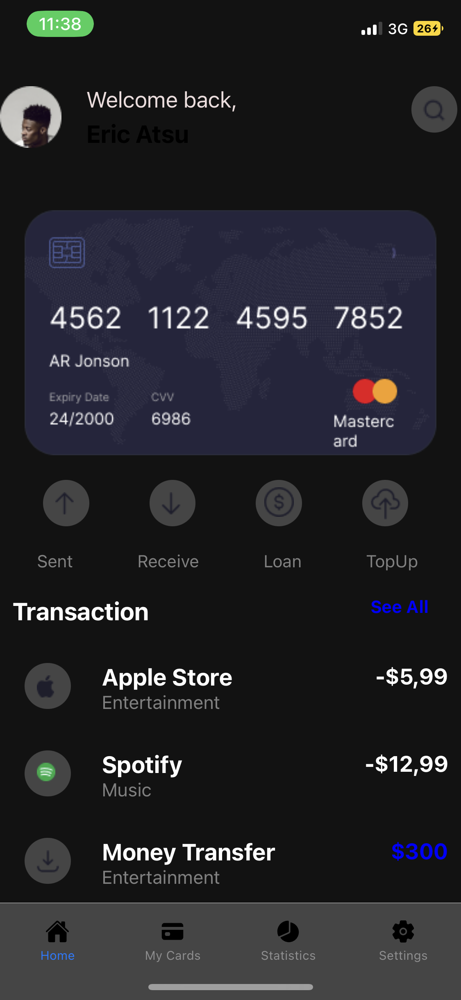
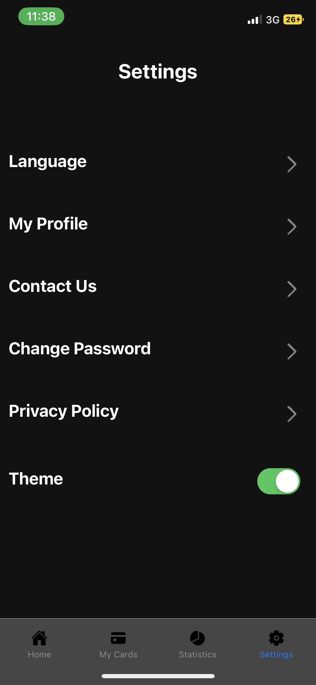

# rn-assignment5-11105718

# ID:11105718

## COMPONENTS USAGE AND SCREENSHOTS

### HOME SCREEN
The home Screen was built using custom components such as HomeTop, which displays the profile of the user, HomeImages, which displays the mastercard image and the transaction images.
A custom component called transactions was made to cater for that part of the screen.

### SETTINGS SCREEN
The settings screen houses custom components such as settingsOptions which show the different options available to the user. 
The theme button is also shown here.

### NAVIGATION
Bottom tabs navigation was used in this assignment.
Some custom images for the icons were also displayed(particularly My Cards and Statistics).
A separate Navigation component was created in a different file and imported into App.js for implementation.

### THEMES
Context API was used to get variables and setters to be used at different points in the program.
When the switch is toggled, the theme of the application changes from dark to light or vice versa.

## LIGHT THEME

## DARK THEME

